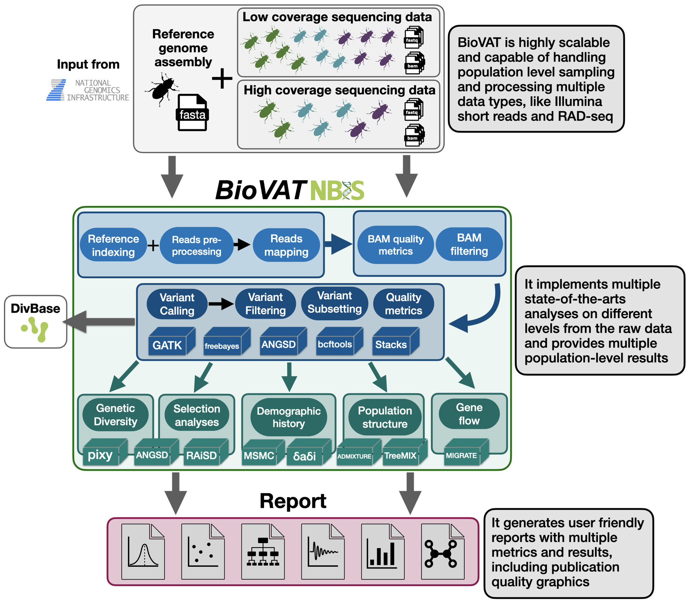

# NBISweden/biovat

[](https://github.com/NBISweden/biovat/actions/workflows/nf-test.yml)
[](https://doi.org/10.5281/zenodo.XXXXXXX)

[](https://www.nextflow.io/)
[](https://docs.conda.io/en/latest/)
[](https://www.docker.com/)
[](https://sylabs.io/docs/)

## Introduction

`BioVAT` (Biodiversity Variant Analysis Toolkit) is a modular Nextflow pipeline for mapping, variant calling, data filtering and downstream analyses of population-level whole genome resequencing data.

<p align="center">
  
</p>

## Usage

> [!NOTE]
> If you are new to Nextflow and nf-core, please refer to [this page](https://nf-co.re/docs/get_started/environment_setup/overview) on how to set-up Nextflow. Make sure to [test your setup](https://nf-co.re/docs/get_started/run-your-first-pipeline) with `-profile test` before running the workflow on actual data.

First, prepare a samplesheet with your input data that looks as follows:

`samplesheet.csv`:

```csv
sample,library_id,lane,platform,fastq_1,fastq_2
S1,01,L002,illumina,AEG588A1_S1_L002_R1_001.fastq.gz,AEG588A1_S1_L002_R2_001.fastq.gz
```

Each row represents a pair of fastq files (paired end).

Next, create a parameter file for your run based on the example file `assets/nf-params.yml` and fill out all relevant parameters.

Now, you can run the pipeline using:

```bash
nextflow run NBISweden/biovat \
   -profile <singularity/conda/.../dardel/arrhenius/pelle> \
   -params-file assets/my-run-params.yml
```

> [!WARNING]
> Please provide pipeline parameters via the CLI or Nextflow `-params-file` option. Custom config files including those provided by the `-c` Nextflow option can be used to provide any configuration _**except for parameters**_; see [docs](https://nf-co.re/docs/running/run-pipelines#using-parameter-files).

## Credits

BioVAT was originally written by Verena Kutschera, Mahesh Binzer-Panchal, Cormac Kinsella, André Soares, Jason Hill, Lorena Ament, Per Unneberg, and Lucile Soler.

We thank the following people for their extensive assistance in the development of this pipeline:

Filip Thörn  
Henrik Lantz  
Jacob Höglund  
Jesper Boman  
José Cerca  
Mafalda Ferreira  
Niclas Backström

## Contributions and Support

If you would like to contribute to this pipeline, please see the [contributing guidelines](docs/CONTRIBUTING.md).

## Citations

<!-- TODO nf-core: Add citation for pipeline after first release. Uncomment lines below and update Zenodo doi and badge at the top of this file. -->
<!-- If you use NBISweden/biovat for your analysis, please cite it using the following doi: [10.5281/zenodo.XXXXXX](https://doi.org/10.5281/zenodo.XXXXXX) -->

<!-- TODO nf-core: Add bibliography of tools and data used in your pipeline -->

An extensive list of references for the tools used by the pipeline can be found in the [`CITATIONS.md`](CITATIONS.md) file.

This pipeline uses code and infrastructure developed and maintained by the [nf-core](https://nf-co.re) community, reused here under the [MIT license](https://github.com/nf-core/tools/blob/main/LICENSE).

> **The nf-core framework for community-curated bioinformatics pipelines.**
>
> Philip Ewels, Alexander Peltzer, Sven Fillinger, Harshil Patel, Johannes Alneberg, Andreas Wilm, Maxime Ulysse Garcia, Paolo Di Tommaso & Sven Nahnsen.
>
> _Nat Biotechnol._ 2020 Feb 13. doi: [10.1038/s41587-020-0439-x](https://dx.doi.org/10.1038/s41587-020-0439-x).
